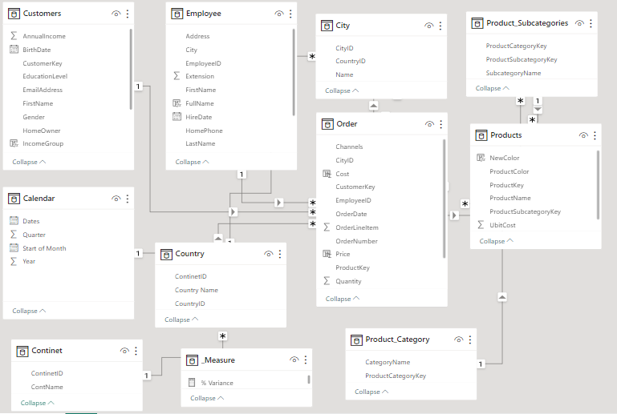
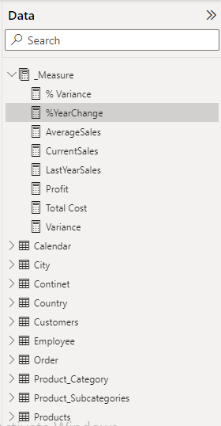
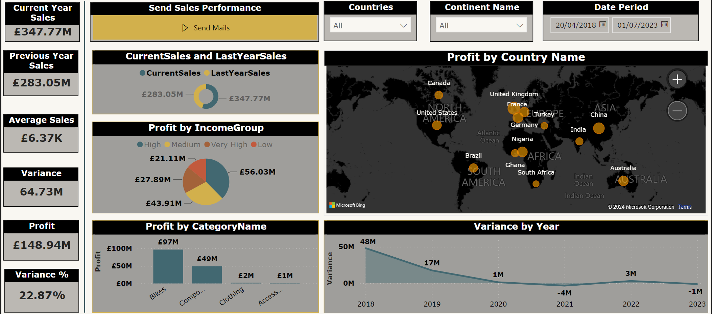
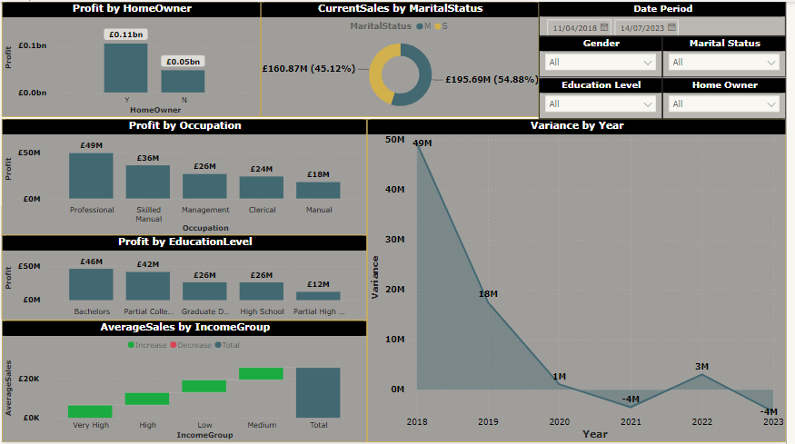
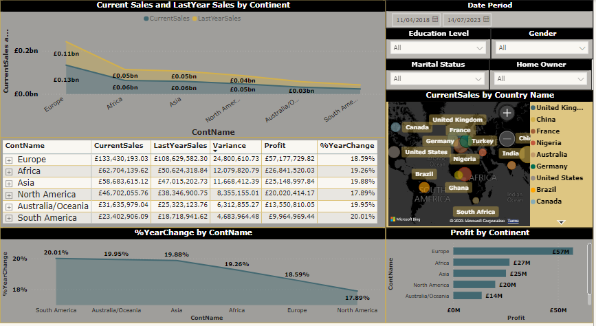
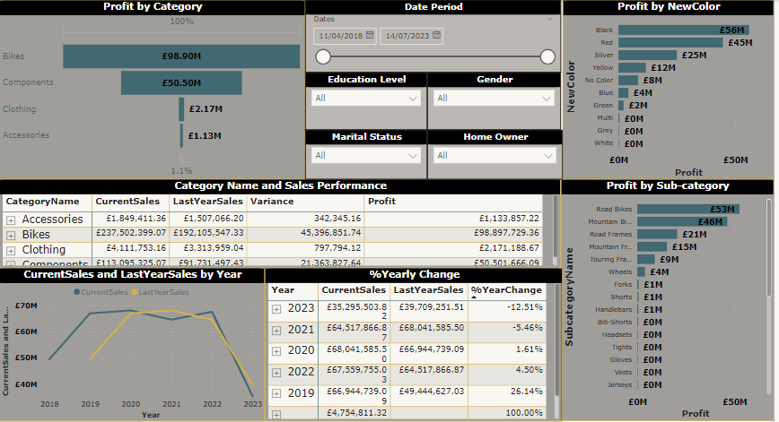

## Company 'X' Sportwears Product Performance and Analysis

---
## Introduction
This is a Power BI Report on product sales performance for company 'X'. The project is to analyse and drive insights to answer crucial business questions and help make the store make data-driven decisions

**_Disclaimer: All datasets and reports  do not represent any company or institution but just a dummy dataset to demonstrate the capablities of Power BI_**

## Problem Statement
1. What is the sales performance of current year
2. Comparison of sales with previous year
3. Yearly Percentile change on profit
4. Best performimng product category, sub-category
5. Demographic performance
---
## Skills Demonstrated
Some of the power BI skills demonstrated are;
- DAX
- Calculated Columns
- Measures
- Modelling
- Filters
- Power Automate / Button
- Maps
## Modelling
- Automatically derived relationships is executed by Power BI intelligence capbilities, however manually the right type of relationships was confirmed.
- The modelling style employed is a **Snowflake Design** with a one-many relationship between these tables
- The data model consist of 9 Dimension table and 1 Fact Table
- See below ;
---
  Model View               |     Table List
:-------------------------:|:-------------------------:
        | 
---
## Visualization
This report comprises of 4 pages :
1. Sales Summary
2. Customer Insights
3. Demographic Insights
4. Products Insights

You can view the report on Power BI Service [Click here](https://app.powerbi.com/groups/me/reports/48e0c48b-5b3e-4474-9e3c-5e81abc3115c/ReportSection?experience=power-bi)
---

## Sales Summary

### Features
- The sales summary page captures the overview performance of the products this showed an increase in sales performance of the present year compared to the previous year
- With £356.56M revenue comapred to £288.66M , there was a profit of £152.70 in the current year
- Income group says persons with medium class income bought more products and contributed more in terms of revenue
- Bikes Category outperformed other categories

## Customer Insights

### Features
- Revenue generated from married customers was higher than single status customers
- Homeowners contribued more to revenue than those withiut homes
- Customers who work manual occupation contributted less as compared to professionals
- Bikes Category outperformed other categories,bike accesories performed least
- In terms of education level, the educated customers with bachelors degree generated more revenue
- Variance shows the figures in terms of pthe yearly performance in comarorsion with projected / predicted outcome

## Demographic Insights

### Features
- The report here shows that customers from Europe contribued more to profit , followed closly by Africa

## Product Insights

### Features
- The visuals shows the comparison of current sales made, previous year sales, profit and the yearly change in percentile
- 2023 saw the worst in decline of sales performance followed by 2021 between year 2019 and 2023, the best performance increase was in the year 2019.
  
## Overview Conclusion
**To improve interaction with the sales representatives and give feedback about their performance, the report was integrated with **Power Automate** a Power BI feature.**
This feature works by connecting selected KPIs with power apps connectors.

For this report, the current sales and previous year sales of these employees was sent to their official email address as seen in the button above.
The report was curated and designed such that stkeholders and report users can drilldown , use filters and slicers to dice the data for certain date ranges and other certain criteria like;
- Occupation Level
- Educational Level
- Marital Status

 

  

  

