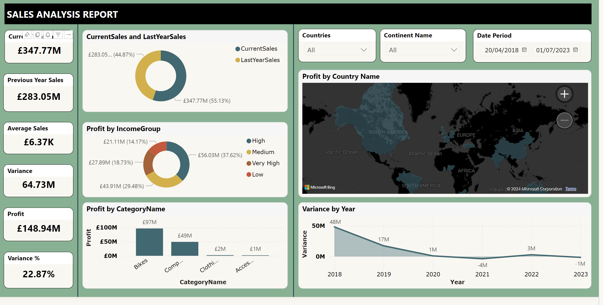
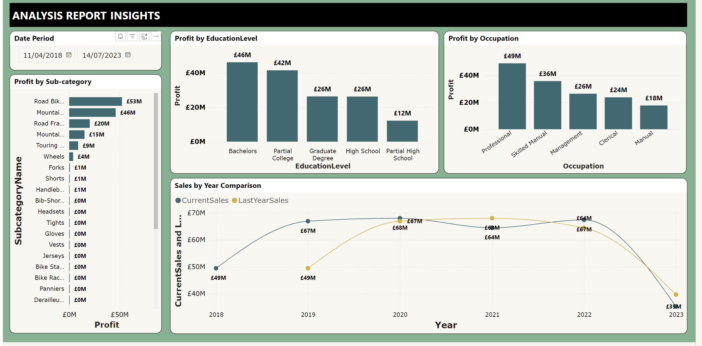

## Company 'X' Sportwears Product Performance and Analysis

---
## Introduction
This is a Power BI Report on product sales performance for company 'X'. The project is to analyse and drive insights to answer crucial business questions and help make the store make data-driven decisions

**_Disclaimer: All datasets and reports  do not represent any company or institution but just a dummy dataset to demonstrate the capablities of Power BI_**

## Problem Statement
1. What is the sales performance of current year
2. Comparison of sales with previous year
3. Yearly Percentile change on profit
4. Best performimng product category, sub-category
5. Demographic performance
---
## Skills Demonstrated
Some of the power BI skills demonstrated are;
- DAX
- Calculated Columns
- Measures
- Modelling
- Filters
- Power Automate / Button
- Maps
## Modelling
- Automatically derived relationships is executed by Power BI intelligence capbilities, however manually the right type of relationships was confirmed.
- The modelling style employed is a **Snowflake Design** with a one-many relationship between these tables
- The data model consist of 9 Dimension table and 1 Fact Table
- See below ;
---
  Model View               |     Table List
:-------------------------:|:-------------------------:
        | 
---
## Visualization
This report comprises of 4 pages :
1. Sales Summary
2. Customer Insights
3. Demographic Insights
4. Products Insights

You can view the report on Power BI Service [Click here](https://app.powerbi.com/groups/me/reports/48e0c48b-5b3e-4474-9e3c-5e81abc3115c/ReportSection?experience=power-bi)
---

## Sales Summary

### Features
- The sales summary page captures the overview performance of the products, this showed an increase in sales performance of the present year compared to the previous year
- With £348M revenue compared to £283M
- Income group says persons with medium class income bought more products and contributed more in terms of revenue
- Bikes Category outperformed other categories
- The report here shows that customers from Europe contribued more to profit, followed closly by Africa

## Customer Insights

### Features
- Customers who work manual occupation contributed less compared to professionals
- Road Bikes SubCategory outperformed other subcategories
- In terms of education level, the educated customers with bachelors degree generated more revenue
- Variance shows the figures in terms of the yearly performance in comparison with projected / predicted outcome
 

## Product Insights

### Features
- The visual shows the drillthrough of granular comparison of profit,sales,average sales,variance by the year of sales
- 2023 saw the worst in decline of sales performance followed by 2021 between year 2019 and 2023, the best performance increase was in the year 2019.
  

 

  

  

